# Self-Improving Vision-Language-Action Models with Data Generation via Residual RL (PLD)
> **论文深度精读与技术全解** | 具身智能 · 视觉-语言-动作大模型 (VLA) · 残差强化学习 · 自我改进数据飞轮

---

## 目录
- [1. 论文速览与核心贡献 (TL;DR)](#1-论文速览与核心贡献-tldr)
- [2. 研究背景与痛点：为什么需要基于残差 RL 的自主改进飞轮？](#2-研究背景与痛点为什么需要基于残差-rl-的自主改进飞轮)
- [3. PLD 核心方法与三阶段闭环架构](#3-pld-核心方法与三阶段闭环架构)
  - [3.1 问题形式化与任务定义 (Task Formulation)](#31-问题形式化与任务定义-task-formulation)
  - [3.2 阶段一：轻量残差专家策略获取 (Specialist Acquisition via Residual RL)](#32-阶段一轻量残差专家策略获取-specialist-acquisition-via-residual-rl)
  - [3.3 阶段二：分布对齐的主动探测与混合轨迹采集 (Hybrid Rollout via Base-Policy Probing)](#33-阶段二分布对齐的主动探测与混合轨迹采集-hybrid-rollout-via-base-policy-probing)
  - [3.4 阶段三：离线泛化蒸馏微调 (Distillation via Architecture-Agnostic SFT)](#34-阶段三离线泛化蒸馏微调-distillation-via-architecture-agnostic-sft)
- [4. 实验结果与深度定量分析](#4-实验结果与深度定量分析)
  - [4.1 残差强化学习的超高样本效率 (Sample Efficiency Benchmarking)](#41-残差强化学习的超高样本效率-sample-efficiency-benchmarking)
  - [4.2 域内多任务微调表现 (In-distribution Evaluation)](#42-域内多任务微调表现-in-distribution-evaluation)
  - [4.3 跨任务与跨域泛化能力 (Zero-shot & Few-shot Generalization)](#43-跨任务与跨域泛化能力-zero-shot--few-shot-generalization)
  - [4.4 短程技能向长程时序任务的复合迁移 (Short-to-Long Horizon)](#44-短程技能向长程时序任务的复合迁移-short-to-long-horizon)
  - [4.5 真实世界机械臂与双臂灵巧操作验证 (Real-World Deployment)](#45-真实世界机械臂与双臂灵巧操作验证-real-world-deployment)
- [5. 核心消融实验与机理剖析 (Deep Dive & Ablation Studies)](#5-核心消融实验与机理剖析-deep-dive--ablation-studies)
  - [5.1 探测步长比例 $\alpha$ 的关键折线](#51-探测步长比例-alpha-的关键折线)
  - [5.2 动作缩放因子 $\xi$ 与预热策略调度](#52-动作缩放因子-xi-与预热策略调度)
  - [5.3 探索策略对比：JSRL、纯专家与 PLD 对比](#53-探索策略对比jsrl纯专家与-pld-对比)
- [6. 轨迹可视化与纠错机制分析 (Visual Insights & Recovery Behaviors)](#6-轨迹可视化与纠错机制分析-visual-insights--recovery-behaviors)
- [7. 局限性与未来探索方向](#7-局限性与未来探索方向)
- [8. 核心要点总结 (Key Takeaways)](#8-核心要点总结-key-takeaways)

---

## 1. 论文速览与核心贡献 (TL;DR)

- **论文标题**：Self-Improving Vision-Language-Action Models with Data Generation via Residual RL
- **作者团队**：Wenli Xiao (肖文力)$^{*1,2}$, Haotian Lin (林浩天)$^{*2}$, Andy Peng$^1$, Haoru Xue$^1$, Tairan He (何泰然)$^1$, Yuqi Xie$^1$, Fengyuan Hu$^1$, Jimmy Wu$^1$, Zhengyi Luo$^1$, Linxi "Jim" Fan (范麟熙)$^1$, Guanya Shi (石冠亚)$^2$, Yuke Zhu (朱玉可)$^{1,4}$
- **合作机构**：NVIDIA (GEAR 实验室), 卡内基梅隆大学 (CMU), 加州大学伯克利分校 (UC Berkeley), 德克萨斯大学奥斯汀分校 (UT Austin)
- **录用/预印**：arXiv: 2511.00091 [cs.RO]
- **项目主页**：[https://wenlixiao.com/self-improve-VLA-PLD](https://wenlixiao.com/self-improve-VLA-PLD)

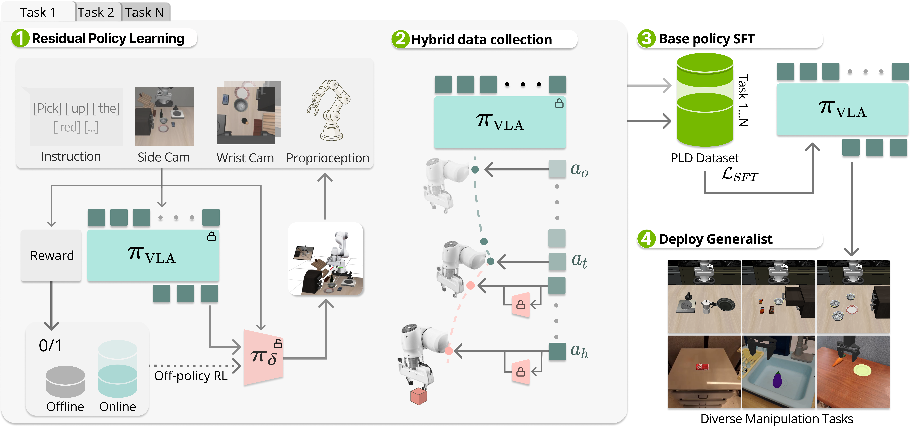
*图 1：PLD (Probe, Learn, Distill) 整体三阶段工作流程。通过冻结基准模型并训练残差专家、主动探测生成包含恢复机制的混合轨迹、最后蒸馏回基准模型，构建无须额外人工示教的自改进飞轮。*

### 核心观点与突破
1. **打破人工遥操作示教的数据瓶颈**：当前视觉-语言-动作 (VLA) 大模型后训练 (Post-training) 严重依赖昂贵的人工遥操作示教，且人工示教与机器人的实际推理分布脱节。PLD 提出一套无需额外人工干预的**自主数据生成与策略改进闭环**。
2. **轻量残差专家解耦设计 (Decoupled Residual RL)**：摒弃了在数十亿参数 VLA 上直接做端到端强化学习的高显存（单卡往往需要 >60GB 显存且极易发散）方案，冻结 VLA 主干网络，仅训练轻量级残差高斯动作头 $\pi_\delta$，利用对称经验回放 ($B_{offline} \cup B_{online}$) 实现高样本效率训练。
3. **主动探测混合采样机制 (Base-Policy Probing)**：设计混合 Rollout 策略——先由基准 VLA 随机执行 $t$ 步探测，在潜在失败区域由残差专家介入接管完成任务。生成的轨迹天然贴合基准模型自身的部署状态分布，且富含关键的**状态恢复行为 (Recovery Behaviors)**。
4. **卓越且通用的自提升表现**：
   - **LIBERO 仿真基准**：在 LIBERO-Spatial、Object、Goal 上平均成功率达到近乎饱和的 **99.2%** (OpenVLA) 与 **97.2%** ($\pi_0$)。
   - **SimplerEnv 真实仿真评测**：相比基线实现超 **+50%** 的大幅性能跃升。
   - **真机双臂与工业级灵巧装配**：在真实 Franka 单臂及双臂 YAM 机器人上部署，达成 **连续 1 小时 GPU 拔插装配任务 0 人工重置干预**。

---

## 2. 研究背景与痛点：为什么需要基于残差 RL 的自主改进飞轮？

在大语言模型 (LLM) 时代，预训练后的监督微调 (SFT) 与强化学习 (RLHF/RLAIF) 构成了模型能力跃升的双引擎。然而在机器人具身智能领域，将这套范式直接迁移面临严重的物理与算法瓶颈：

```mermaid
graph TD
    subgraph 传统遥操作SFT瓶颈
        A1[人工专家遥操作] --> B1[成本极高/数据极难扩展]
        B1 --> C1[遥操作数据与真实部署分布偏离]
        C1 --> D1[遇轻微扰动即进入未见状态崩溃]
    end

    subgraph 直接端到端VLA强化学习瓶颈
        A2[全量/LoRA微调VLA大模型] --> B2[单步前向反向显存巨大 >62GB]
        B2 --> C2[稀疏奖励下多任务探索极易发散]
        C2 --> D2[高频控制交互耗时过长不可承受]
    end

    subgraph PLD解耦自改进飞轮 (本文方案)
        A3[冻结VLA作为基础先验] --> B3[轻量残差头快速探索收敛]
        B3 --> C3[主动探测生成分布对齐+恢复轨迹]
        C3 --> D3[蒸馏微调通用VLA闭环自我迭代]
    end
```

### 1. 人工遥操作示教的局限性 (Teleoperation Bottleneck)
- **缺乏失败恢复样本**：人类操作员在遥操作过程中通常只演示完美、顺滑的成功轨迹。一旦机器人部署时遭遇微小执行偏差或物体滑移，便会陷入人工示教中从未出现过的状态空间（OOD States），进而产生级联漂移（Compounding Error）导致任务彻底失败。
- **状态访问分布偏移 (Distribution Shift)**：离线收集的数据分布 $p_{demo}(s)$ 与当前策略的闭环部署轨迹分布 $p_\pi(s)$ 存在天然鸿沟。

### 2. 端到端 VLA 强化学习的工程与算法困境 (Direct RL Challenges)
- 近期工作尝试直接对 VLA 进行在线 RL 微调（如 PARL, ExPO, OpenVLA-OFT）。但 VLA 通常基于多模态大模型（如 2B~7B 级别），在强化学习频繁的 Rollout 循环中，即便 batch size 设为 8，单张 GPU 显存占用依然高达 **62.5 GB**，无法稳定扩展到复杂的多任务异构环境。
- 在连续高维控制与稀疏二值奖励（Sparse Binary Reward）下，从零探索极度困难，容易导致基准模型的灾难性遗忘。

### 3. 纯 RL 专家数据的狭隘性 (Pure RL Data Pitfall)
- 如果直接用一个训练完备的纯 RL 专家在环境里采样数据并回喂给 VLA 进行 SFT，其行为分布往往极窄且单一（过度最优，从不犯错、从不犹豫）。实验表明，盲目增加这种纯专家数据，反而会导致 VLA 泛化性和鲁棒性下降。

**PLD 的核心洞察**：
> **利用现有 VLA 的先验来引导探索，利用极轻量的残差策略在失败边缘提供关键辅助，最后在基准策略的实际访问分布上采集“包含纠错行为”的数据，将其无损蒸馏回通用大模型。**

---

## 3. PLD 核心方法与三阶段闭环架构

PLD 包含三个紧密配合的阶段：**阶段一：残差专家策略获取**、**阶段二：分布对齐的混合轨迹收集**、**阶段三：离线泛化蒸馏微调**。

### 3.1 问题形式化与任务定义 (Task Formulation)

设定目标条件的马尔可夫决策过程 (Goal-Conditioned MDP) 为 $\mathcal{M} = (\mathcal{S}, \mathcal{A}, \rho, \rho_0, r, \gamma)$：
- **状态观测 $o_t$**：包含第一人称 RGB 图像与机器人本体感受（关节角速度、末端位姿等）。
- **任务目标 $g$**：自然语言指令提示词（例如 *"open the top drawer"*）。
- **动作空间 $a_t \in \mathbb{R}^7$**：包含末端执行器的 6-DoF 相对位姿变化 ($\Delta x, \Delta y, \Delta z, \Delta \text{roll}, \Delta \text{pitch}, \Delta \text{yaw}$) 以及 1-DoF 夹爪开合连续控制量。
- **稀疏奖励函数**：仅在任务成功时提供二值奖励 $r(s, a, g) = \mathbf{1}[d(\phi(s), g) \le \varepsilon]$。

基础策略输出形式化为：
$$a_t = D_\phi\big(h_\theta(o_t, g)\big)$$
其中 $h_\theta$ 为多模态视觉-语言主干，$D_\phi$ 为动作解码头（流匹配或离散 Token 解码器）。

---

### 3.2 阶段一：轻量残差专家策略获取 (Specialist Acquisition via Residual RL)

为了规避全量模型 RL 的高昂开销，PLD 采用解耦架构：
1. **冻结基准策略 $\pi_b$**：保留预训练 VLA 的视觉表征与基本操控语义。
2. **附加残差动作策略 $\pi_\delta$**：以当前状态 $s$ 和基础动作 $a_b \sim \pi_b(\cdot|s)$ 为条件，输出高斯残差校正量 $a_\delta$：
   $$\bar{a} = a_b + a_\delta, \quad a_\delta \sim \pi_\delta(\cdot \mid s, a_b)$$
3. **探索动作截断与平滑调度 (Action Scaling)**：
   为避免在初期随机探索时残差策略彻底破坏基准动作，将残差动作的幅度限制在 $[-\xi, \xi]$，并通过调度器逐步衰减或控制权重。
4. **对称双缓冲池经验回放 (Symmetric Hybrid Replay Buffer)**：
   维护两个独立的存储池：
   - 离线缓冲池 $\mathcal{B}_{offline}$：预先存入由基准策略 $\pi_b$ 自主运行所获得的任务成功轨迹。
   - 在线缓冲池 $\mathcal{B}_{online}$：在线强化学习交互中产生的经验数据。
   在每个更新步骤中，以 $1:1$ 的平衡比例从两个缓冲池中对等采样 mini-batch，以保证价值函数 $Q^{\bar{\pi}}$ 持续在高质量状态-动作对上保持校准，避免离散探索引发的 Q 漂移：
   $$Q^{\bar{\pi}}(s_t, \bar{a}_t) \leftarrow r(s_t, \bar{a}_t) + \gamma\, \mathbb{E}_{s_{t+1}}\big[ Q_{target}^{\bar{\pi}}(s_{t+1}, \bar{a}_{t+1}) \big]$$

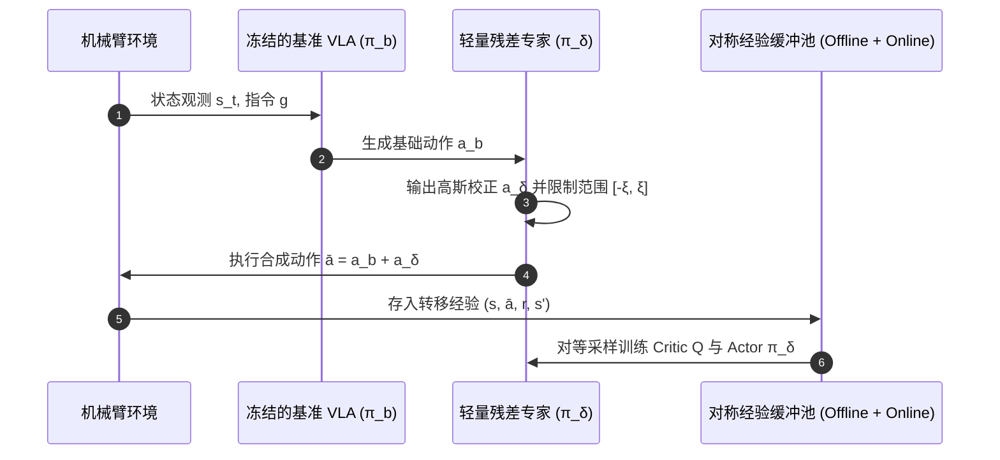

---

### 3.3 阶段二：分布对齐的主动探测与混合轨迹采集 (Hybrid Rollout via Base-Policy Probing)

纯 RL 专家动作往往直接沿着最短路径执行，忽略了基准策略容易犯错的真实状态。为此，PLD 提出了核心的**基准策略主动探测机制 (Base Policy Probing)**：

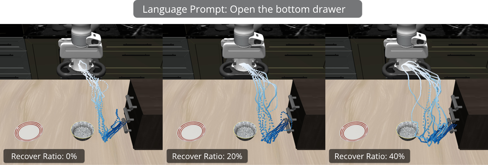
*图 2：不同探测步长下的轨迹多样性与空间覆盖。随着基准策略探测时间比例提升，轨迹覆盖了更多偏离最优轨迹的状态，展现出丰富的重定位与纠错恢复行为。*

- **两段式混合执行流程**：
  在每个数据收集 Episode 中，随机选取初始探测步长 $T_{base} \sim [0, \alpha T]$（其中 $\alpha \in [0, 1]$）：
  $$\pi(s_t) = \begin{cases} a_{b, t}, & t < T_{base} \quad (\text{由基准 VLA 独立执行，主动探索真实部署分布}) \\ a_{b, t} + a_{\delta, t}, & t \ge T_{base} \quad (\text{残差专家介入接管，纠正累积偏差并完成任务}) \end{cases}$$
- **生成优质轨迹集 $\mathcal{D}^{PLD}$**：
  当整条混合轨迹最终成功时，将该完整轨迹存入微调数据集。该数据集天然兼备两种优势：
  1. **状态分布对齐**：前序状态完全位于基准策略实际推理的访问状态流形上；
  2. **内置恢复策略**：后序动作完整演示了如何从近乎失控、偏离目标或卡顿的状态中脱困并成功到达终点。

---

### 3.4 阶段三：离线泛化蒸馏微调 (Distillation via Architecture-Agnostic SFT)

采集到高质量混合轨迹集 $\mathcal{D}^{PLD}$ 后，通过行为克隆 (SFT) 将这些能力重新蒸馏融合进通用 VLA 模型中：

1. **针对自回归离散 Token 架构 (如 OpenVLA)**：
   $$\mathcal{L}_{AR}(\theta) = - \mathbb{E}_{k \sim [K]}\left[ \log p_\theta(u_k \mid u_{<k}, x) \right]$$
2. **针对流匹配连续控制架构 (如 $\pi_0$)**：
   $$\mathcal{L}_{flow}(\theta) = \mathbb{E}_{t, x, a}\left[ \| v_t - v_\theta(a_t^{(t)}, x, t) \|_2^2 \right]$$

通过这种即插即用的架构无关蒸馏，通用基础策略直接吸收了多任务残差专家的能力，且保留了原模型的泛化多模态表征。

---

## 4. 实验结果与深度定量分析

论文在 **LIBERO 终身学习基准**、**SimplerEnv 真实度仿真** 以及 **真实世界 Franka / YAM 机械臂** 上进行了极其严密的评测。

### 4.1 残差强化学习的超高样本效率 (Sample Efficiency Benchmarking)

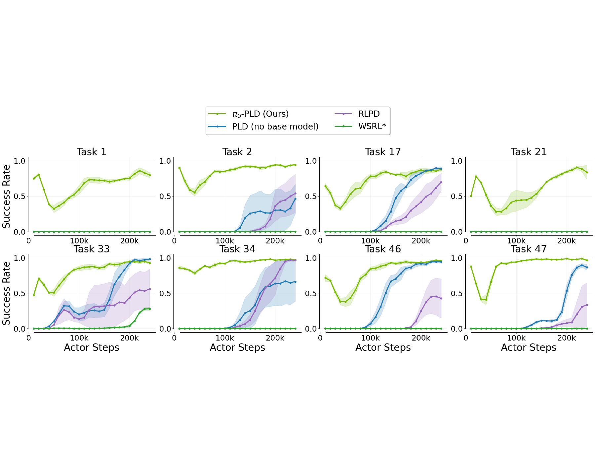
*图 3：PLD 与当前主流强化学习算法（WSRL、RLPD 等）在 LIBERO-90 随机选取的 8 个复杂操控任务上的在线训练收敛曲线对比。*

- **收敛速度与胜率**：在仅 250k 步的在线交互预算下，PLD 凭借基准策略提供的先验以及对称双缓冲池，以明显更优的样本效率在所有任务上迅速爬升到 **>95%** 的高胜率，大幅领先基线方法（RLPD 和 WSRL 均在部分任务上出现探索停滞）。
- **初期探究下探现象**：训练初期，PLD 曲线呈现轻微掉落，随后快速拉升。这精确印证了残差策略初期开始偏离基准策略、积极探索潜在次优解与边界状态的学习机理。

---

### 4.2 域内多任务微调表现 (In-distribution Evaluation)

论文分别将流匹配架构 $\pi_0$ 与自回归架构 OpenVLA 作为骨干网络，在 LIBERO 三大经典测试集以及 SimplerEnv 上评估 PLD 数据蒸馏后的性能提升：

#### 表 1：LIBERO 基准各子集评测成功率对比 (%)
| 模型架构 | 训练数据来源 | LIBERO-Spatial | LIBERO-Object | LIBERO-Goal | 平均成功率 (Avg) |
| :--- | :--- | :---: | :---: | :---: | :---: |
| **$\pi_0$ (Flow-matching)** | 原始基线 (SFT) | 95.2 | 97.6 | 87.4 | 93.4 |
| | **+ PLD 数据 (Ours)** | **97.7** | **98.5** | **95.3** | **97.2** |
| | *绝对提升 ($\Delta$)* | *+2.5* | *+0.9* | *+7.9* | **+3.8** |
| **OpenVLA (Token-based)** | 原始基线 (OFT) | 92.9 | 99.1 | 83.25 | 91.8 |
| | **+ PLD 数据 (Ours)** | **99.5** | **99.1** | **98.9** | **99.2** |
| | *绝对提升 ($\Delta$)* | *+6.6* | *+0.0* | *+15.7* | **+7.4** |

> **深入洞察**：在复杂度最高的 **LIBERO-Goal** 子集上，由于目标语言条件跨度大且容易混淆，基线策略错误率最高；而 PLD 分别带来 **+7.9%** 和 **+15.7%** 的巨大绝对增益，将 OpenVLA 总成绩推向近乎极限的 **99.2%**。

#### 表 2：SimplerEnv 跨实体真实仿真评测成功率 (%)
| 方法 | WidowX Pick Eggplant | WidowX Pick Carrot | Google Open Drawer | Google Coke Can | 平均成功率 (Avg) |
| :--- | :---: | :---: | :---: | :---: | :---: |
| Octo-SFT | 65.5 | 43.3 | 92.5 | 85.7 | 71.8 |
| **+ PLD (Ours)** | **97.8** | **93.9** | **99.3** | **95.5** | **96.6** |
| *提升幅度 ($\Delta$)* | **+32.3** | **+50.6** | **+6.8** | **+9.8** | **+24.9** |

---

### 4.3 跨任务与跨域泛化能力 (Zero-shot & Few-shot Generalization)

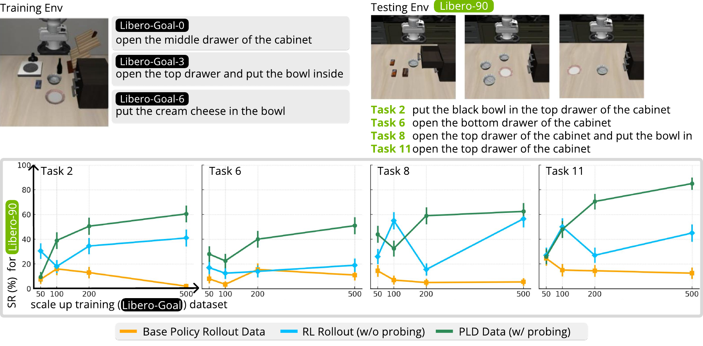
*图 4：(左) LIBERO-Goal 源任务规模扩展对 LIBERO-90 未见任务 Few-shot 性能的持续单调增益；(右) 在未见任务环境中的少样本快速适应能力。*

#### 1. 未见任务的零样本迁移 (Zero-shot Transfer on Unseen Tasks)
在 LIBERO-90 中，随机选取不同任务覆盖率（10% ~ 80%）的任务训练残差专家并收集数据，在全部 90 个任务上评测泛化指标：
- **PLD 数据**：即便只在 10% 的任务上收集数据进行微调，依然能在剩余 90% 未见任务上取得 **24.4%** 的零样本成功率，并在全体任务上达到 31.4% 的综合得分。
- **自采样引导 (0-1 REINFORCE / Base Rollout)**：容易陷入模式坍塌，未见任务得分仅 5.6%，表现出严重的过拟合。
- **对比纯人工示教**：PLD 数据在相同样本量下不仅域内表现更优，在跨任务零样本泛化上也能与昂贵的人类数据打平甚至反超。

---

### 4.4 短程技能向长程时序任务的复合迁移 (Short-to-Long Horizon)

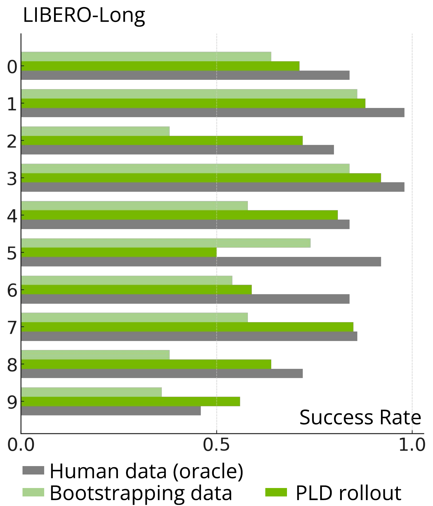
*图 5：在 LIBERO-90 短程原子任务上训练并收集数据，直接单样本 (1-shot) 评估于 LIBERO-10 长程复杂组合任务的表现。*

- 在 LIBERO-90 上获得的原子技能与纠错先验，在仅提供 1 条长程演示作为上下文引导时，PLD 微调后的策略显著优于自举基线，展现出强大的**时间序列技能复用与长程容错韧性**。

---

### 4.5 真实世界机械臂与双臂灵巧操作验证 (Real-World Deployment)

作者搭建了高难度无约束的真实物理评测平台：
1. **单臂 Franka Emika Panda (7-DoF)**：
   - 测试任务：方块抓取放置 (Pick-and-place) 与 销钉精准孔装配 (Peg insertion)。
   - **完全开放随机扰动**：物体位置随机抛洒，无死区保护。

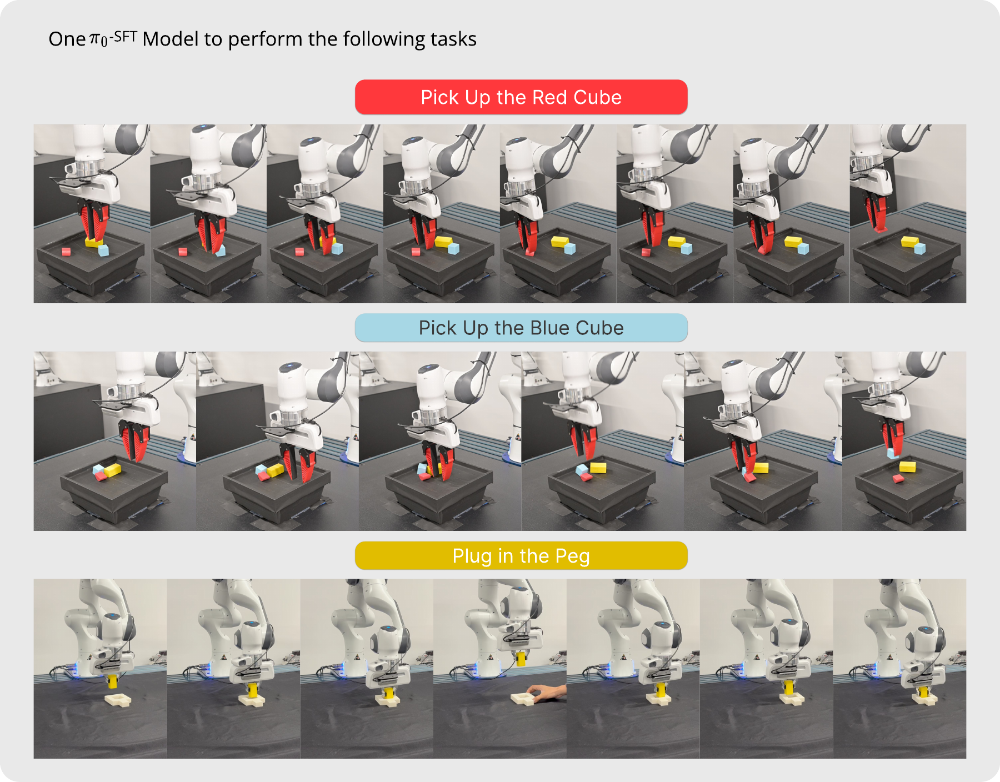
*图 6：真实世界 Franka 机械臂在多种复杂语言指令任务中的泛化与鲁棒性评测结果。*

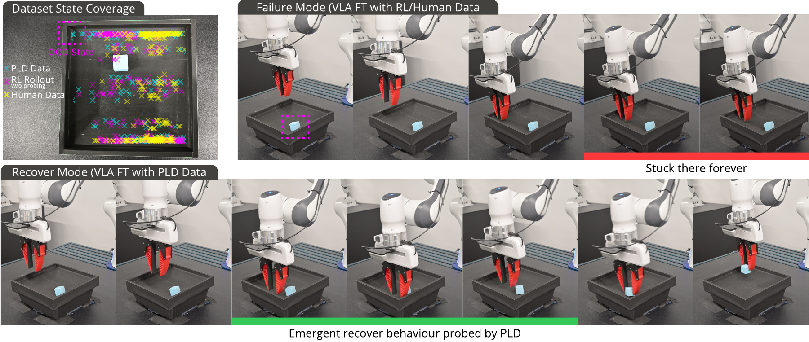
*图 7：典型边缘失败场景与 PLD 闭环自恢复对比。基准策略和纯 RLPD/人类数据训练策略在把方块推挤到角落时发生夹爪死锁导致任务失败，而 PLD 模型能主动向后退回并重新定位姿态，成功实现 100% 抓取。*

- **量化评测结果 (30 次独立随机实验)**：
  - **销钉装配 (Peg Insertion)**：各方法均达成 30/30 (100%)。
  - **方块抓取 (Cube Pick-up)**：
    - 人类数据微调 ($\mathcal{D}^{Human}$): **10/30 (33.3%)**
    - 纯 RLPD 数据微调 ($\mathcal{D}^{RLPD}$): **16/30 (53.3%)**
    - **PLD 数据微调 ($\mathcal{D}^{PLD}$)**: **30/30 (100.0%)**

2. **双臂 YAM 灵巧操作平台：工业级 GPU 插拔装配**：
   - 任务包含四个连续状态机阶段：从桌面拾取显卡 $\to$ 插入 Slot 1 $\to$ 拔出并移至 Slot 3 $\to$ 紧实压入卡槽 $\to$ 拔出并放回桌面。
   - 借助轻量残差训练与蒸馏，机器人实现了**整整 1 小时连续自主循环运行，无需任何人工重置介入**！

---

## 5. 核心消融实验与机理剖析 (Deep Dive & Ablation Studies)

### 5.1 探测步长比例 $\alpha$ 的关键折线

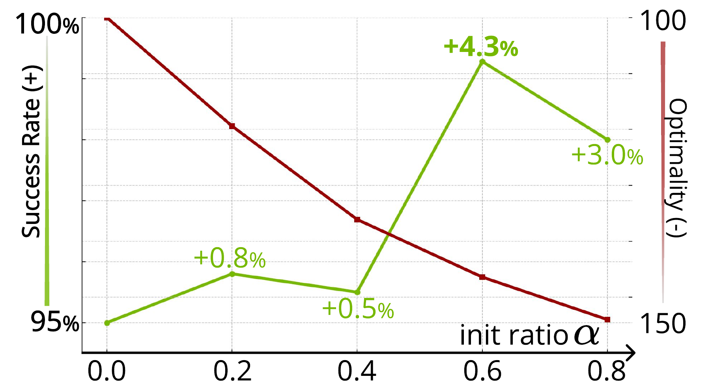
*图 8：基准探测比例 $\alpha$ 对微调后泛化成功率的影响曲线。*

- 设定基准前置探测步长 $T_{base} \sim [0, \alpha T]$，测试 $\alpha \in \{0.0, 0.2, 0.4, 0.6, 0.8\}$：
  - 当 $\alpha = 0$（纯残差专家从头执行）：数据多样性低，缺乏基准策略真实分布样本，效果较差。
  - 随着 $\alpha$ 提升，平均完成轨迹变长，包含大量自救纠错步骤，性能持续攀升并在 **$\alpha = 0.6$ 时达到峰值**。
  - 当 $\alpha > 0.6$ 时，由于基准策略走得过远导致系统进入无法挽回的物理死局（如物体掉落桌面外），残差专家接管也无法完成任务，使得有效数据产出率下降。

### 5.2 动作缩放因子 $\xi$ 与预热策略调度

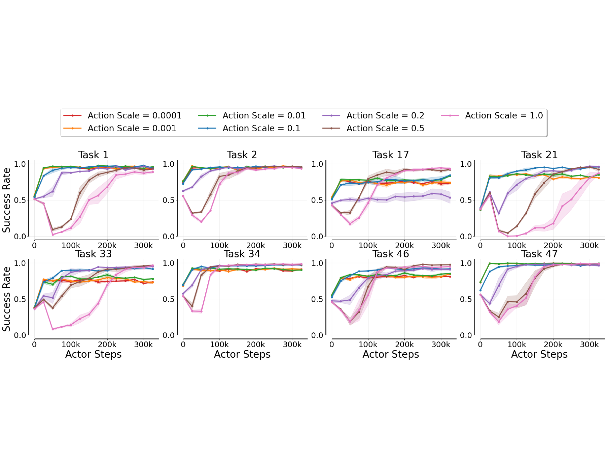
*图 9：动作缩放因子 $\xi$ 对训练稳定性与探索效率的敏感度分析。*

- 将残差范围限制在 $[-\xi, \xi]$，若 $\xi$ 过大（如 $1.0$），初期高斯噪声破坏基准策略先验导致探索效率崩塌；若 $\xi$ 过小（如 $<0.05$），残差无法跨越局部最优位姿。适度截断（如 $0.2 \sim 0.3$）能够实现平滑的高效收敛。

### 5.3 探索策略对比：JSRL、纯专家与 PLD 对比

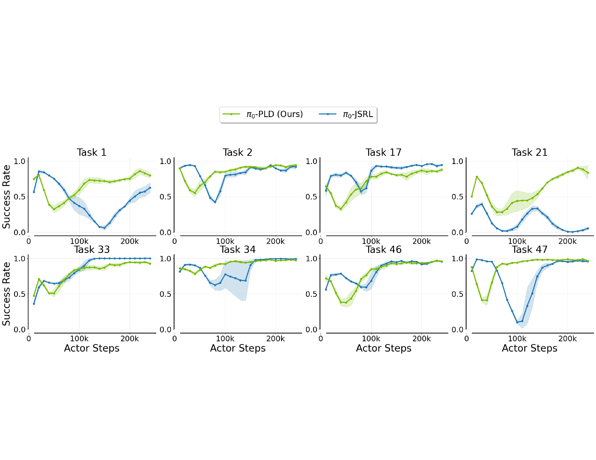
*图 10：PLD 与跳跃启动强化学习 (JSRL) 及纯 RL 专家的动作分布与累积回报对比。*

- 传统的 JSRL (Jump-Start RL) 强行设定硬性时间阈值，在切换点易产生动态不匹配；而 PLD 凭借连续残差融合和端到端 Q-value 引导，展现出更好的轨迹连续性与平滑度。

---

## 6. 轨迹可视化与纠错机制分析 (Visual Insights & Recovery Behaviors)

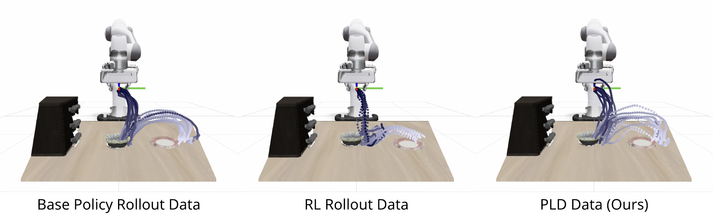
*图 11：在 Franka 机械臂上各类数据源的 20 条末端执行器轨迹空间分布对比（任务："pick up the black bowl and place it on the plate"）。*

- **纯 RL 专家轨迹**：极其集中且僵硬，轨迹方差极小。虽然成功率高，但只要外界稍加阻挡或物体偏转，由于缺乏空间多样性，策略立即失效。
- **基准 VLA 轨迹**：分布分散，在接近物体边缘处存在大量犹豫、抖动以及发散的失败轨迹。
- **PLD 生成轨迹**：在前段完美重合于基准 VLA 的空间流形，在中后段通过平滑的扇形包络展开，完整记录了当机械臂抓取偏离几何中心时如何主动纠偏并成功落盘的轨迹。这解释了为何 PLD 微调能够给大模型带来抗扰鲁棒性。

---

## 7. 局限性与未来探索方向

1. **不可逆失败的约束 (Irreversible Failure Modes)**：
   若基础策略在前向探测中导致物体掉落出操作台或发生机械碰撞，残差专家在物理上无法扭转局势。未来可引入在线安全价值护栏或失败预测器（Failure Predictor）提前触发接管。
2. **多任务残差专家的存储与合并**：
   目前每个任务需要训练独立的轻量残差专家网络。探索将多个残差专家利用模块化 LoRA 或超网络 (Hypernetwork) 进行权重融合是未来的扩展方向。
3. **扩展到全身双足人形控制**：
   目前实验聚焦于 7-DoF 机械臂与桌面灵巧操作，未来有望推广到包含全身移动控制 (Whole-body Control) 的人形机器人复杂长程导航与操作中。

---

## 8. 核心要点总结 (Key Takeaways)

| 维度 | 传统 VLA 遥操作微调 | 直接端到端 VLA-RL | PLD 自我改进方案 (本文) |
| :--- | :--- | :--- | :--- |
| **数据成本** | 极高（需专业人员长期遥操作） | 极高计算成本（需数十张大显存 GPU） | **低成本**（自动化闭环生成，无额外示教） |
| **状态分布** | 人工理想轨迹，与部署分布偏离 | 在线分布，但容易发散和灾难性遗忘 | **完美对齐**（前序探测贴合部署，后序补全纠错） |
| **鲁棒恢复** | 缺少纠错样本，易受扰动崩溃 | 依赖随机试错，难以稳定习得纠错 | **天然富集状态自恢复行为** |
| **下游表现** | 域内较优，跨任务泛化弱 | 难以扩展至多任务 | **LIBERO 达到 99.2% 饱和成功率，仿真到真实 100% 成功** |

> **结语**：PLD 证明了通过**“先验引导探索、残差探测边缘、混合轨迹对齐、统一离线蒸馏”**这一解耦自改进范式，具身智能模型完全可以摆脱对海量昂贵人工遥操作示教的刚性依赖，迈出通往自主进化通用机器人策略的关键一步。
